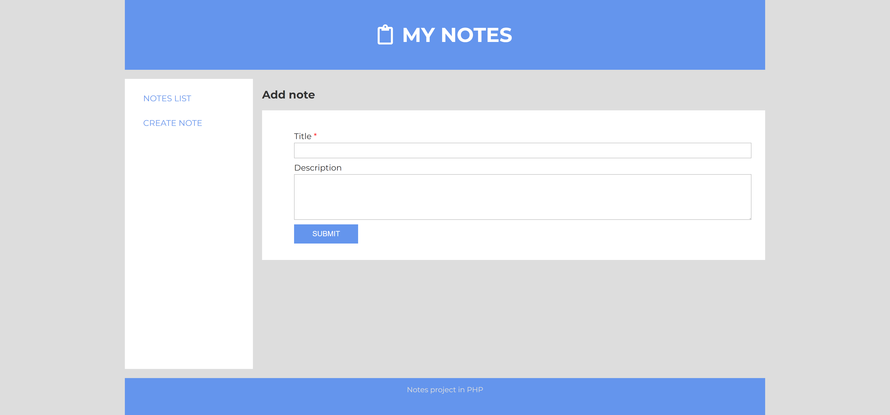
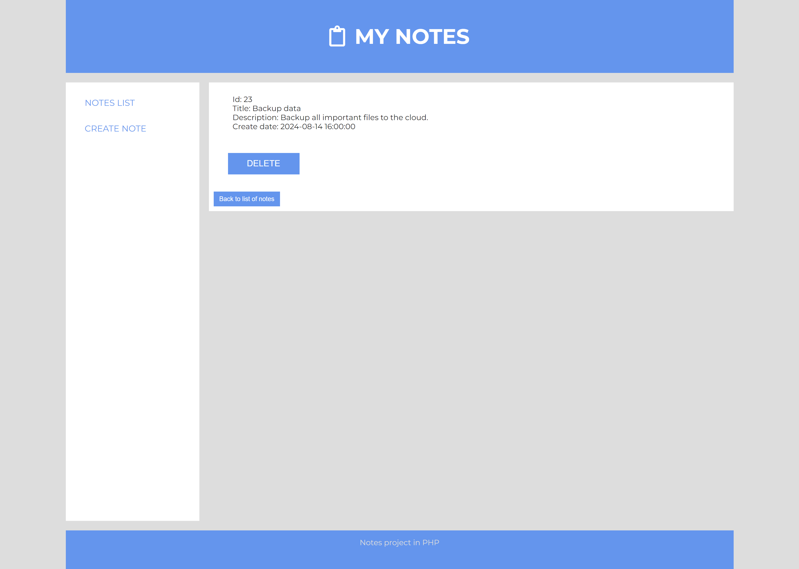
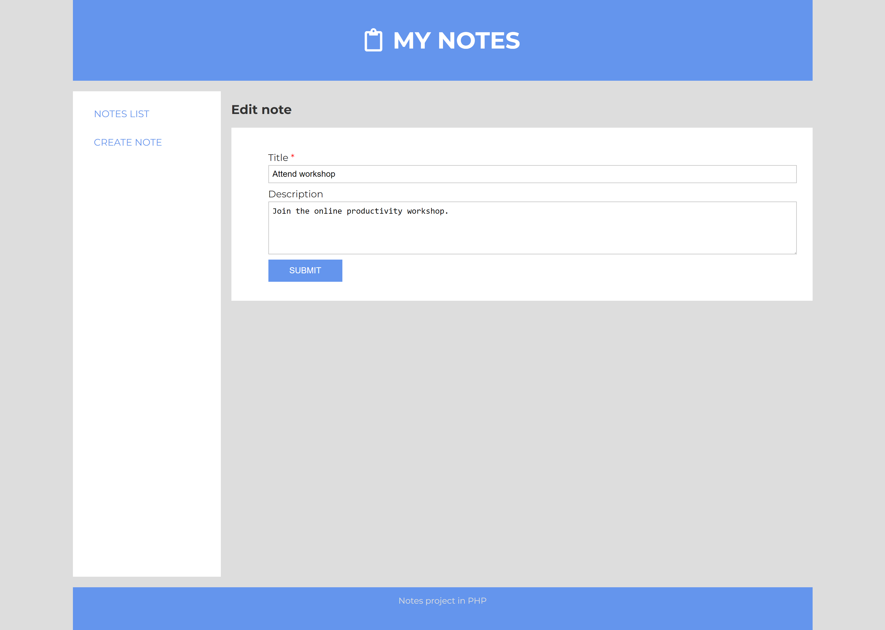
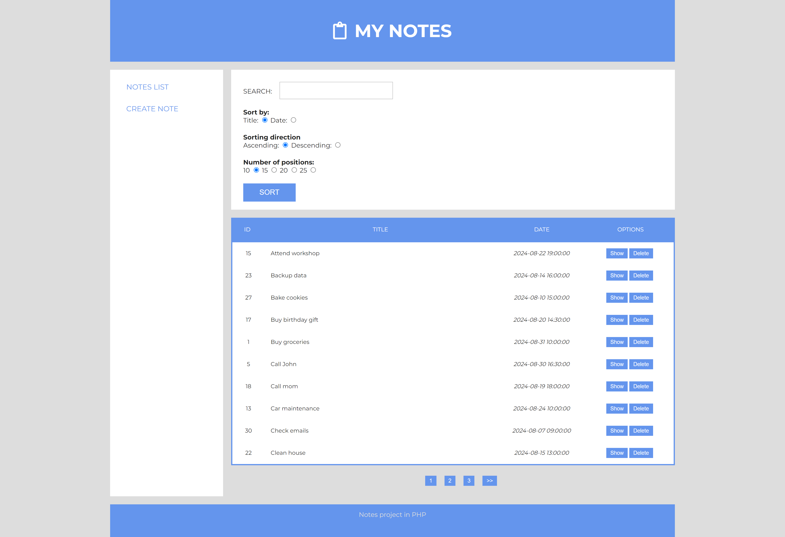
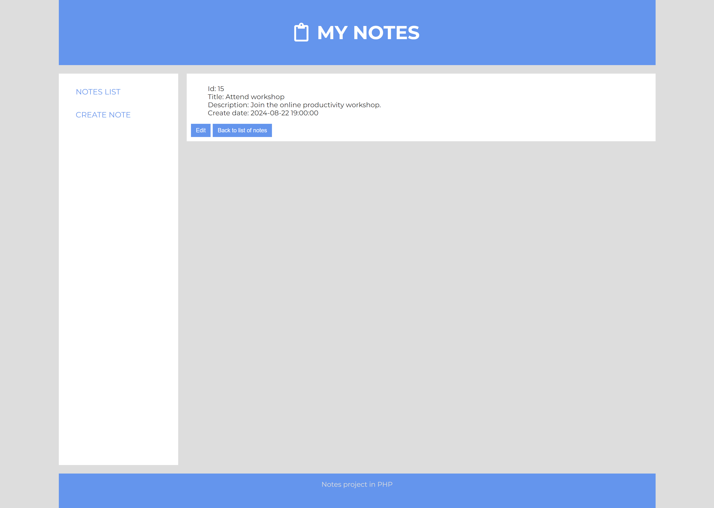

# Notes Web App 📝

This is a web application project for managing notes. The project is built using PHP with an object-oriented MVC (Model-View-Controller) architecture. It also includes error handling.

## Features

- User-friendly interface for creating, editing, and deleting notes.
- MVC architecture for clean and organized code.
- Error handling to ensure a smooth user experience.

## Getting Started

To run this project, follow these steps:

1. **Host the Project**:
   Host the project on a web server of your choice. You can use Apache, Nginx, or any other web server that supports PHP.

2. **Database Setup**:
   Create a database in your chosen database management system (e.g., MySQL) to store the notes. You can use the provided `notes.sql` file to create the necessary table.

   ```sql
   CREATE DATABASE notesdb;
   USE notesdb;
   SOURCE path/to/notes.sql;
   ```


3. **Configure Database**:
   Open the config.php file and update the database connection details to match your setup.

   ```sql
    return  [
        'db'=> [
        'host'=>'localhost',
        'database'=>'notes',
        'user'=>'notes_user',
        'password'=>'notes'
        ]
    ];
   ```

4. **Run the Application**:
   Access the project in your web browser. You should now be able to create and manage notes.

## Running the Application

Access the project in your web browser. You should now be able to create and manage notes.

## Screenshots

### Add Note


### Delete Note


### Edit Note


### Notes List


### Show Note


## Acknowledgments

- Built with PHP, following best practices for MVC architecture.
- Error handling inspired by industry standards.
- Database management using MySQL.